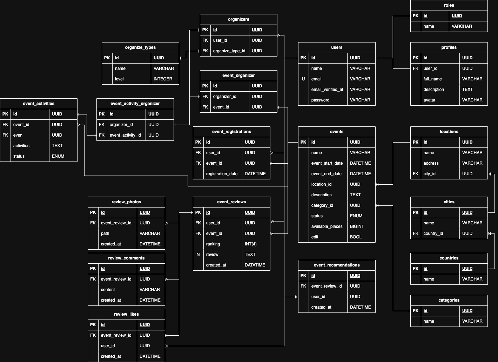

# Event Manager

Sistema de gestión de eventos desarrollado con Laravel 10 y PHP 8.3.

## Descripción

Event Manager es una aplicación web robusta diseñada para la gestión integral de eventos. Permite a los organizadores crear, gestionar y analizar eventos de manera eficiente, mientras proporciona a los participantes una experiencia fluida para registrarse y participar.

## Características Principales

- 🎯 Gestión completa de eventos
- 👥 Gestión de usuarios y roles
- 🔐 Sistema de autenticación seguro
- 📧 Notificaciones por correo electrónico
- 📈 Reportes y estadísticas
- 🔍 Búsqueda avanzada de eventos

## Requisitos del Sistema

- PHP >= 8.3
- Composer
- Postgres
- Node.js >= 18.x
- NPM >= 9.x

## Instalación

1. Clonar el repositorio:
```bash
git clone https://github.com/Gersomsim/Event-manager.git
cd Event-manager
```

2. Instalar dependencias de PHP:
```bash
composer install
```

3. Instalar dependencias de Node.js:
```bash
npm install
```

4. Configurar el entorno:
```bash
cp .env.example .env
php artisan key:generate
```

5. Configurar la base de datos en el archivo `.env`:
```
DB_CONNECTION=pgsql
DB_HOST=127.0.0.1
DB_PORT=5432
DB_DATABASE=event_manager
DB_USERNAME=root
DB_PASSWORD=
```

6. Ejecutar migraciones y seeders:
```bash
php artisan migrate --seed
```

7. Compilar assets:
```bash
npm run dev
```

8. Iniciar el servidor:
```bash
php artisan serve
```

## Estructura del Proyecto

```
event-manager/
├── app/
│   ├── Http/
│   │   ├── Controllers/
│   │   ├── Middleware/
│   │   └── Requests/
│   ├── Models/
│   ├── Services/
│   └── Repositories/
├── database/
│   ├── migrations/
│   └── seeders/
├── resources/
│   ├── js/
│   └── views/
└── tests/
```

## Diagrama Entidad-Relación (ERD)

Aquí puedes ver el esquema de la base de datos:



## Tecnologías Utilizadas

- Laravel 10
- PHP 8.3
- Postgres
- Laravel Sanctum

## Contribución

1. Fork el proyecto
2. Crea tu rama de características (`git checkout -b feature/AmazingFeature`)
3. Commit tus cambios (`git commit -m 'feat: add some amazing feature'`)
4. Push a la rama (`git push origin feature/AmazingFeature`)
5. Abre un Pull Request

## Licencia

Este proyecto está bajo la Licencia MIT. Ver el archivo `LICENSE` para más detalles.

## Contacto

Tu Nombre - [@gersomsim](https://twitter.com/gersomsim) - email@ejemplo.com

Link del Proyecto: [https://github.com/Gersomsim/Event-manager](https://github.com/Gersomsim/Event-manager)